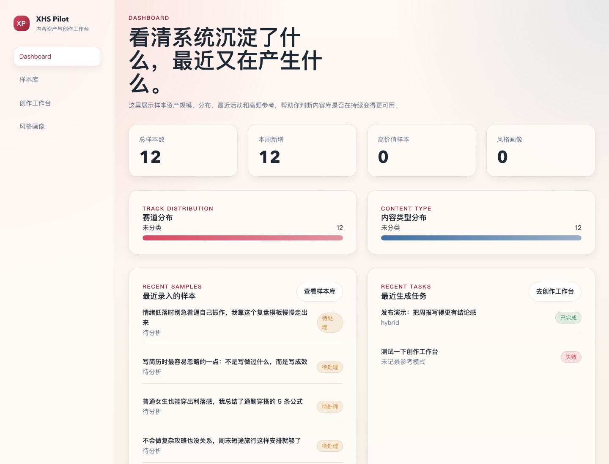
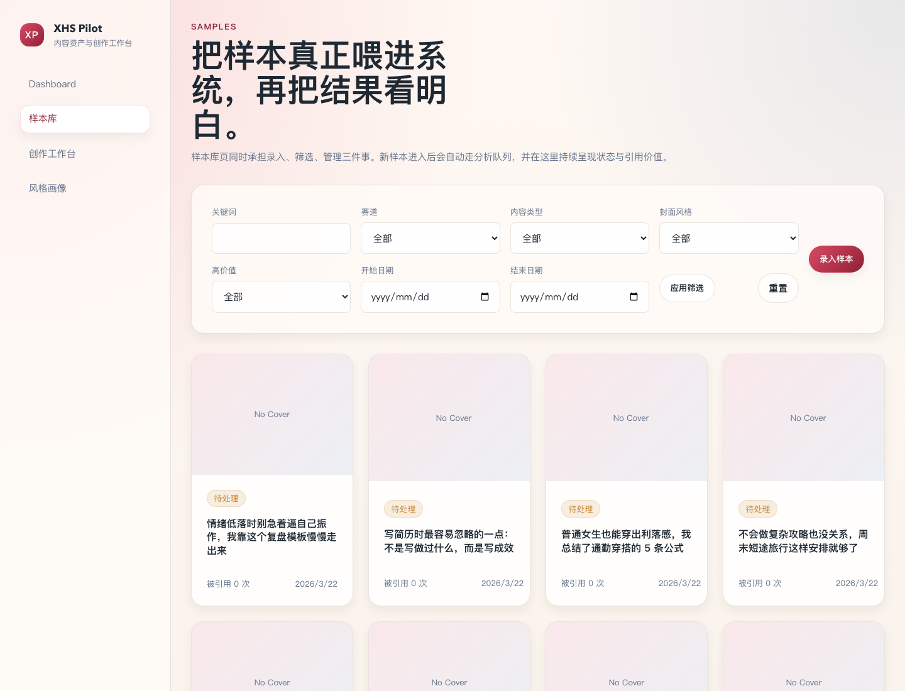
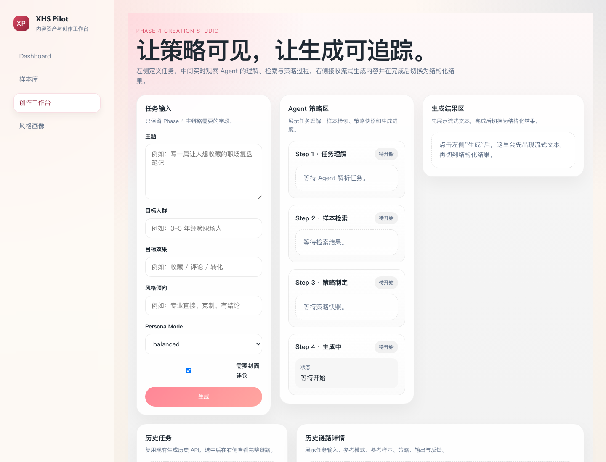

# XHS Pilot

> 面向单用户自托管场景的小红书内容资产、检索与创作工作台。

XHS Pilot 不是“下载一个桌面安装包就双击运行”的本地软件，而是一个 **自托管 Web 应用**。  
它的标准使用方式是：拉取仓库、复制 `.env.example`、配置 LLM、执行 `docker compose up -d --build`，然后在浏览器里使用。

## 这是什么

XHS Pilot 把“小红书内容沉淀 → 结构化分析 → 检索参考 → 策略制定 → 生成内容”串成一条可追踪链路。  
它适合希望自己掌控数据、模型和部署方式的开发者、独立开发者和技术型内容运营者。

适合：

- 想沉淀自己的小红书样本库
- 想做有参考依据的内容生成，而不是纯黑盒出稿
- 能接受 Docker Compose 自托管

不适合：

- 希望下载 `dmg` / `exe` 直接双击运行的非技术用户
- 需要多用户协作、权限系统、云托管 SaaS 的团队
- 需要离线生成或对象存储大规模部署的场景

## 产品预览

### Dashboard



### 样本库



### 创作工作台



## 当前能力

- 样本录入：标题、正文、图片、来源链接、手动标签
- 自动分析：异步完成文本分析、视觉分析和 embedding 入库
- 样本管理：样本库列表、详情页、人工修正、高价值标记
- 创作工作台：任务理解、参考检索、策略快照、流式生成
- 风格画像：手动分组、样本关联、画像列表与详情
- 历史链路：在 `/create?taskId=<id>` 查看参考、策略、输出和反馈
- PWA 外壳：可安装、可缓存静态壳、离线时有友好提示
- 备份恢复：支持 `local` 存储模式下的 PostgreSQL + `uploads/` 备份恢复

## 当前支持范围

- 官方支持部署方式：Docker Compose
- 官方支持存储方式：`STORAGE_PROVIDER=local`
- 当前定位：单用户、自托管、same-origin
- 当前不包含：认证、多用户、`s3/r2` 存储、自动首启 seed、离线生成、桌面安装包

## 技术栈

| 层 | 技术 |
|----|------|
| 前端 | Next.js 16.2.1 + React 19 |
| 后端 | Next.js Route Handlers |
| 队列 | BullMQ + Redis |
| 数据库 | PostgreSQL 16 + pgvector |
| LLM 接入 | Vercel AI SDK + OpenAI-compatible APIs |
| 分发方式 | GitHub 源码仓库 + Docker Compose |

## 最快启动方式

```bash
git clone https://github.com/txbdtc2017/xhs-pilot.git
cd xhs-pilot
cp .env.example .env
```

编辑 `.env` 后启动：

```bash
docker compose up -d --build
```

打开：

```bash
http://localhost:17789
```

基础健康检查：

```bash
curl http://localhost:17789/api/health
```

如果你想快速看到非空页面，可以手动执行：

```bash
npm run seed
```

这会插入一组演示样本，用于 Dashboard、样本库和检索链路冒烟，不会在 `docker compose up -d` 时自动执行。

## `.env` 核心配置

XHS Pilot 使用 OpenAI-compatible 接口，最关键的配置如下：

```bash
LLM_BASE_URL=https://api.openai.com/v1
LLM_API_KEY=sk-xxx
LLM_MODEL_ANALYSIS=gpt-4o
LLM_MODEL_GENERATION=gpt-4o
LLM_MODEL_VISION=gpt-4o

EMBEDDING_BASE_URL=${LLM_BASE_URL}
EMBEDDING_API_KEY=${LLM_API_KEY}
EMBEDDING_MODEL=text-embedding-3-small
EMBEDDING_DIMENSIONS=1536

STORAGE_PROVIDER=local
MAX_UPLOAD_SIZE_MB=10
```

### OpenAI

```bash
LLM_BASE_URL=https://api.openai.com/v1
LLM_API_KEY=sk-xxx
```

### Ollama

```bash
LLM_BASE_URL=http://host.docker.internal:11434/v1
LLM_API_KEY=ollama
LLM_MODEL_ANALYSIS=qwen2.5
LLM_MODEL_GENERATION=qwen2.5
LLM_MODEL_VISION=qwen2.5vl
```

说明：

- 当前 `docker-compose.yml` 已为 `app` 和 `worker` 补了 `host.docker.internal:host-gateway`
- 如果你直接在本机开发模式跑应用，也可以改成 `http://localhost:11434/v1`

### DeepSeek

```bash
LLM_BASE_URL=https://api.deepseek.com
LLM_API_KEY=sk-xxx
LLM_MODEL_ANALYSIS=deepseek-chat
LLM_MODEL_GENERATION=deepseek-chat
```

### 中转代理

```bash
LLM_BASE_URL=https://your-proxy.com/v1
LLM_API_KEY=sk-xxx
```

## 产品使用 vs 本地开发

### 产品使用

这是默认推荐方式：

```bash
docker compose up -d --build
```

此时你运行的是容器里的构建产物，浏览器访问应用，不需要自己手动跑前后端多进程。

### 本地开发

如果你要改代码、调试页面或 Agent 链路，再用开发模式：

```bash
npm run dev
npm run worker:dev
```

数据库和 Redis 仍然需要你本地可用，或者通过 Docker 单独起起来。

## 数据备份与恢复

当前 Phase 6 只支持 `Docker Compose + STORAGE_PROVIDER=local`。

```bash
# 备份
bash scripts/backup.sh

# 恢复（必须显式传 --force）
bash scripts/restore.sh backups/xhs-pilot-YYYYMMDD-HHMMSS.tar.gz --force
```

备份包会包含：

- `database.sql.gz`
- `uploads.tar.gz`
- `metadata.json`

## PWA 说明

- 浏览器可安装到主屏幕
- 会缓存静态壳和离线提示页
- 断网时会回退到 `/offline`

当前 PWA 不承诺：

- 离线创作生成
- 离线样本浏览
- 离线数据库或队列执行

## GitHub 发布与版本

当前项目的正式发布形态是：

- GitHub 仓库源码
- Git tag
- GitHub Release
- Docker Compose 使用说明

当前不提供：

- 桌面安装包
- GHCR / Docker Hub 官方镜像
- 一键安装器

维护者发布流程见 [docs/release-playbook.md](docs/release-playbook.md)。

## 常见问题

### 这是桌面软件吗？

不是。它是自托管 Web 应用，浏览器访问，Docker Compose 是默认运行方式。

### 我是不是在“跑源码”？

默认不是。`docker compose up -d --build` 会构建容器并运行构建产物。  
只有在你执行 `npm run dev` / `npm run worker:dev` 时，才是在本地开发模式下跑源码。

### 页面为什么是空的？

如果你刚启动完且库里没有数据，这是正常的。执行：

```bash
npm run seed
```

### 样本一直是 `pending` 怎么办？

优先检查：

- `worker` 是否正常运行
- Redis 是否可连
- LLM / Vision / Embedding 配置是否正确

可以先看：

```bash
docker compose logs worker --tail=200
```

### 我能公网直接暴露吗？

不建议裸暴露。当前项目没有应用内认证，推荐你自己加：

- 反向代理
- Basic Auth
- 内网访问或 IP 白名单
- HTTPS

## 安全边界

- `.env` 默认被 `.gitignore` 忽略，不进入版本控制
- 没有任何 `NEXT_PUBLIC_*` secret
- LLM Key 只在服务端读取
- API 默认 same-origin，不开放跨域调用
- 文件上传限制为 JPEG / PNG / WebP，单次最多 9 张，大小受 `MAX_UPLOAD_SIZE_MB` 控制

这是一个单用户自托管工具。若需要公网暴露，请自行通过外围设施加固。

## 已知限制

- 当前只支持本地文件存储，不支持 `s3/r2`
- 当前 seed 仅提供演示数据，不会自动触发完整分析结果预烘焙
- 历史任务详情入口位于创作工作台内部，不是独立页面
- 当前仓库以“源码 + Docker Compose”形式分发，不提供桌面安装包

更多后续能力见 [docs/roadmap.md](docs/roadmap.md)。

## License

[MIT](LICENSE)
