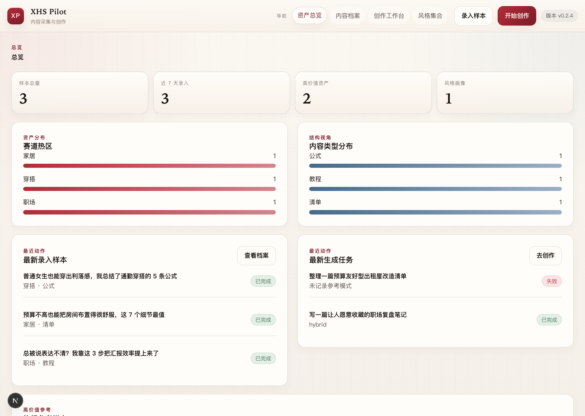

# XHS Pilot

> 面向单用户自托管场景的小红书内容资产、检索与创作工作台。

[快速开始](#快速开始) · [核心能力](#核心能力) · [项目边界](#项目边界) · [文档](#文档) · [贡献](./CONTRIBUTING.md) · [License](./LICENSE)

XHS Pilot 是一个自托管 Web 应用，用于把“小红书样本沉淀、结构化分析、参考检索、策略制定、内容生成”收口到同一个工作台。项目当前面向开发者、独立开发者和技术型内容运营者，默认通过 Docker Compose 部署，在浏览器中使用。

> 注意：这不是下载 `dmg` / `exe` 后双击运行的桌面软件。当前正式发布形态是 GitHub 源码仓库 + Docker Compose。

## 这个项目解决什么问题

- 把分散在聊天记录、表格和收藏夹里的样本沉淀成可维护的内容资产
- 在生成前先做参考检索和策略整理，而不是直接黑盒出稿
- 让样本分析、创作过程和历史结果都保留可追溯链路
- 让使用者自己掌控模型、数据和部署方式，而不是依赖托管 SaaS

## 适合谁

| 适合 | 不适合 |
| --- | --- |
| 想自托管内容研究与创作流程的个人用户 | 想下载桌面安装包直接使用的非技术用户 |
| 需要带参考依据的内容生成工作流 | 需要多用户协作、权限系统或云托管 SaaS 的团队 |
| 接受 Docker Compose、环境变量和本地部署的开发者 | 需要 `s3/r2`、对象存储或大规模部署方案的场景 |

## 核心能力

| 模块 | 说明 |
| --- | --- |
| 样本资产 | 录入标题、正文、图片、来源链接和标签，支持高价值标记与人工修正 |
| 异步分析 | 自动完成文本分析和视觉分析；配置 embedding 时可额外写入向量 |
| 研究检索 | 支持结构化过滤；embedding 配置完整时启用 hybrid 检索，不完整时自动回退 lexical-only |
| 创作工作台 | 提供任务理解、参考检索、策略快照、流式生成、图片计划与异步出图 |
| 历史链路 | 在 `/create?taskId=<id>` 回放参考、策略、输出版本、图片计划与反馈 |
| 产品化能力 | 提供 PWA 外壳、Docker Compose 自托管和本地存储备份恢复 |

## 界面预览



## 技术栈

| 层 | 技术 |
| --- | --- |
| 前端 | Next.js 16.2.1 + React 19 |
| 后端 | Next.js Route Handlers |
| 队列 | BullMQ + Redis |
| 数据库 | PostgreSQL 16 + pgvector |
| LLM 接入 | Vercel AI SDK + OpenAI-compatible / Anthropic Messages APIs |
| 分发方式 | GitHub 源码仓库 + Docker Compose |

## 快速开始

### 1. 准备环境

需要本机安装并可用：

- Docker / Docker Compose
- 一组可用的 LLM 配置

### 2. 克隆仓库并准备配置

```bash
git clone https://github.com/txbdtc2017/xhs-pilot.git
cd xhs-pilot
cp .env.example .env
```

### 3. 编辑 `.env`

最少需要补齐一组可用的 LLM 配置：

```bash
LLM_PROTOCOL=openai
LLM_BASE_URL=https://api.openai.com/v1
LLM_API_KEY=sk-xxx
LLM_MODEL_ANALYSIS=gpt-4o
LLM_MODEL_GENERATION=gpt-4o
LLM_MODEL_VISION=gpt-4o
```

补充说明：

- 当前支持 `openai` 与 `anthropic-messages` 两种 LLM 协议
- `VISION_*` 可与文本共用 provider，也可以独立覆盖
- 图片生成能力是可选项，支持 OpenAI-compatible 和 Google Banana
- `EMBEDDING_*` 是可选增强项；任意关键项缺失时会回退到 `lexical-only`
- 完整注释模板见 [`.env.example`](.env.example)

### 4. 启动服务

```bash
docker compose up -d --build
```

启动时会先运行一次性的 `migrate` 服务，待数据库迁移成功后再启动 `app` 和 `worker`。如果启动卡住，优先查看：

```bash
docker compose logs migrate --tail=200
```

### 5. 打开应用

默认监听端口为 `17789`：

```bash
http://localhost:17789
```

健康检查：

```bash
curl http://localhost:17789/api/health
```

如果想快速看到非空页面，可以手动注入演示数据：

```bash
npm run seed
```

如果你需要修改监听端口，请通过进程环境注入，而不是写进 `.env`：

```bash
PORT=3000 docker compose up -d --build
```

## 配置说明

XHS Pilot 当前的配置边界比较明确：

- LLM 主链路支持 `openai` 与 `anthropic-messages`
- 视觉解析链路优先读取 `VISION_PROTOCOL` / `VISION_API_KEY` / `VISION_BASE_URL`；未设置时逐字段回退到 `LLM_*`
- 图片生成链路与 Vision 解析分开配置，支持 OpenAI-compatible 与 Google Banana
- Embedding 仍使用 OpenAI-compatible 语义；未完整配置时系统保持可用，但检索模式会退回 `lexical-only`
- 当前官方仅支持 `STORAGE_PROVIDER=local`

更完整的配置注释、provider 示例和运行时说明请直接查看 [`.env.example`](.env.example)。

## 项目边界

### 当前官方支持

- 单用户、自托管、same-origin 的部署方式
- Docker Compose 作为默认运行方案
- `STORAGE_PROVIDER=local`
- GitHub 仓库源码 + Git tag + GitHub Release 的分发方式
- 本地 `uploads/` 目录的备份与恢复

### 当前不包含

- 应用内认证、多用户与 SaaS 化能力
- `s3/r2` 或其他对象存储支持
- 桌面安装包、一键安装器
- GHCR / Docker Hub 官方镜像
- 离线生成、离线样本浏览或离线队列执行

如果你计划公网暴露该服务，建议自行在外围加固，例如反向代理、Basic Auth、IP 白名单和 HTTPS。当前项目不提供内建认证。

## 文档

- [`.env.example`](./.env.example)：完整环境变量模板和注释
- [CONTRIBUTING.md](./CONTRIBUTING.md)：本地开发、提交流程和贡献约定
- [SECURITY.md](./SECURITY.md)：漏洞披露与支持范围说明
- `scripts/backup.sh` / `scripts/restore.sh`：本地备份与恢复脚本

## 贡献

欢迎提交 bug 修复、文档完善、测试补充和当前产品边界内的体验优化。提交较大改动前，建议先阅读 [CONTRIBUTING.md](./CONTRIBUTING.md) 并确认是否需要先开 issue 讨论。

## License

[MIT](./LICENSE)
