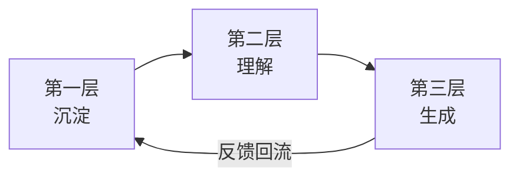
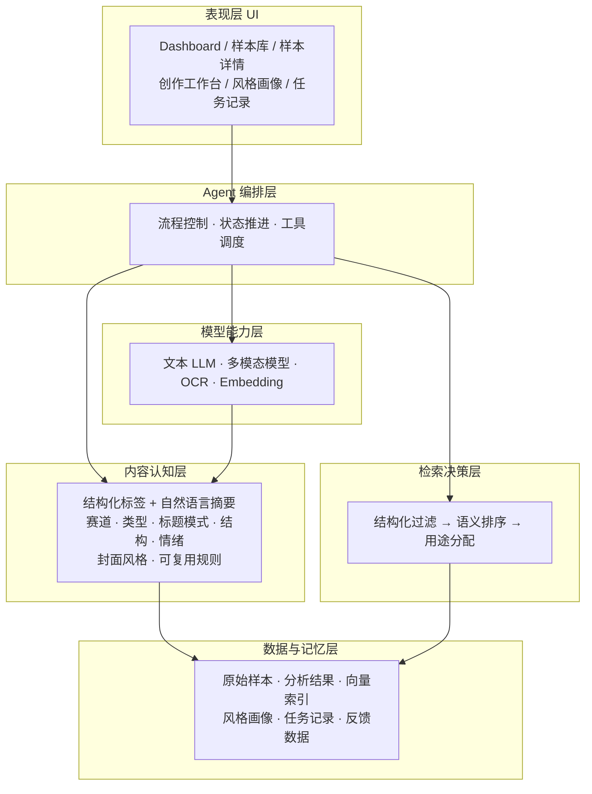
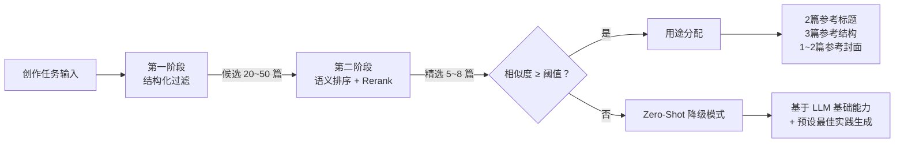
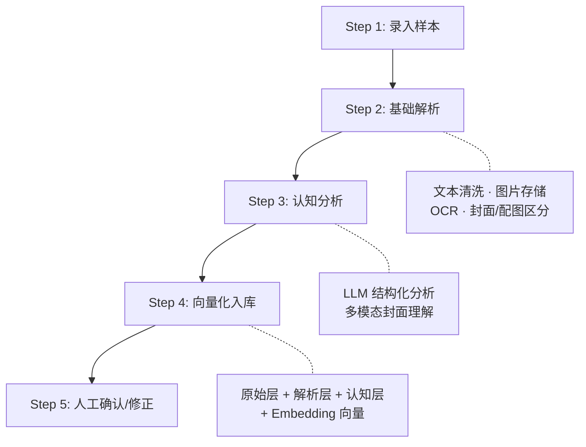
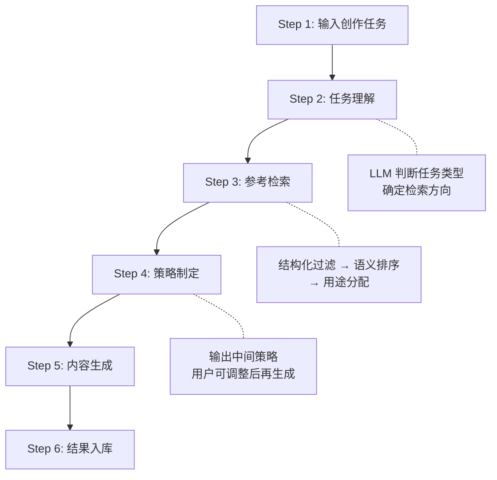
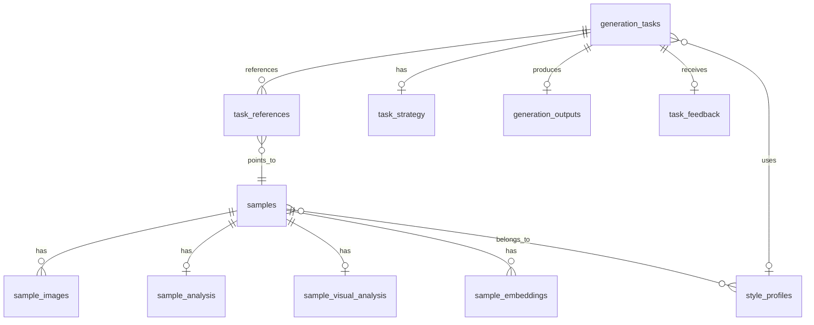
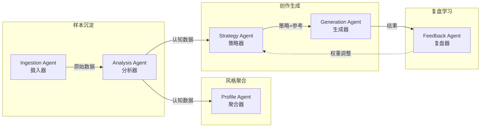
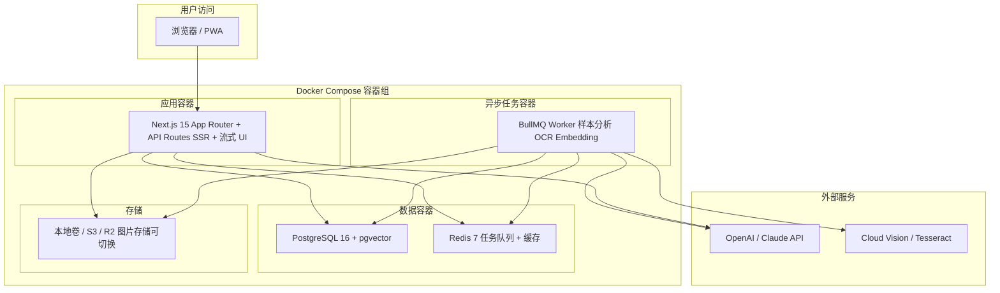

# XHS Pilot — 小红书内容 Agent 系统完整产品方案

> 本文档基于原始设计方案，融合多轮技术评审优化建议，形成一份可直接用于开发的完整产品方案。

---

## 一、产品定位

### 1.1 一句话定义

> **面向小红书内容生产的长期记忆型专业 Agent 系统**
> 本质：Agent + 内容资产库 + 检索决策层 + 创作工作台

### 1.2 解决的核心问题

| # | 问题 | 解法 |
|---|------|------|
| 1 | 我每天看到很多爆文，看完就过去了 | 结构化沉淀为可检索的内容资产 |
| 2 | 沉淀了很多内容，但创作时用不起来 | 中间认知层 + 语义检索，沉淀直接驱动生成 |
| 3 | AI 生成的内容随机、没有依据 | 策略层先选参考再生成，每次输出可解释 |
| 4 | 不知道系统"学到了什么" | Dashboard + 风格画像，沉淀状态可视 |
| 5 | 不知道某次生成为什么这么写 | 参考链路完整展示：参考了谁 → 策略是什么 → 为什么这么写 |

### 1.3 不做什么（Phase 1 边界）

- ❌ 不做大模型训练 / 微调
- ❌ 不做通用聊天机器人
- ❌ 不做自动发布 / 运营托管
- ❌ 不做自动出图
- ❌ **不做用户认证（Auth）** — 纯单机自用，无登录/注册
- ❌ **不做多用户数据隔离** — 数据库无 `user_id` 字段
- ❌ **不做访问控制** — 网络暴露风险由用户自行通过内网/防火墙解决

---

## 二、核心目标（三层模型）



### 第一层：沉淀 — 从收藏夹到内容资产

- 支持图文样本录入（标题、正文、封面、配图、标签、链接）
- 自动 OCR 提取图中文字
- 自动打标签（赛道、类型、风格）
- 支持搜索、筛选、分组管理

### 第二层：理解 — 业务可验证的结构化分析

- 识别内容类型、赛道分类
- 拆解标题套路、开头策略、主体结构
- 识别情绪强度、信任感来源、CTA 类型
- 识别封面风格、贴图元素、排版特征
- 提取"可复用规则"和"不建议模仿点"
- **所有分析结果分为两种输出：枚举标签（检索用）+ 自然语言摘要（生成参考用）**

### 第三层：生成 — 有依据地参考式生成

- 先做任务理解和策略制定，再生成内容
- 输出标题、正文、CTA、封面文案、标签、首评
- 展示参考了哪些样本、参考了什么维度
- 支持多版本对比

---

## 三、Agent 总体架构（六层）



### 3.1 表现层

UI 页面，详见第五章。

### 3.2 Agent 编排层

> Phase 1 使用**固定流水线**，Phase 2 引入 LLM 路由调度。

Phase 1 的编排方式：每个工作流是硬编码的步骤序列，按**快慢分离**原则调度：

```
【慢任务 — BullMQ 异步队列，后台执行】
样本沉淀流程：录入 → 基础解析 → 多模态分析 → 认知分析 → Embedding → 入库 → 人工确认

【快任务 — API Route 流式响应，用户在线等】
创作生成流程：任务输入 → 任务理解 → 参考检索 → 策略制定（流式）→ 内容生成（流式）→ 结果入库
```

> [!IMPORTANT]
> **快慢分离是 Phase 1 的关键架构决策**。样本分析等耗时操作走 BullMQ Worker 异步处理；策略制定和内容生成直接在 API Route 中调用 LLM stream，配合 Vercel AI SDK 实现流式打字机效果，避免 Worker → Redis → SSE 的过度复杂链路。

Phase 2 升级：在创作流程中引入 LLM 路由（由 LLM 判断任务类型 → 动态决定检索策略）。

### 3.3 内容认知层（最关键）

每篇样本经过分析后产出**结构化输出**，分两种形态：

| 输出形态 | 用途 | 示例 |
|----------|------|------|
| **枚举标签** | 用于检索、筛选、聚合统计 | `title_pattern: ["数字型", "结果先行"]` |
| **自然语言摘要** | 注入生成 prompt 做参考 | `"标题用了反差对比，前半句制造痛点..."` |

> [!IMPORTANT]
> 这是本系统与"拼 prompt"工具的核心分界线。没有这层，系统就退化成了带收藏夹的 ChatGPT。

### 3.4 检索决策层

采用**两阶段检索**架构，含冷启动降级机制：



**第一阶段：结构化过滤（SQL）**
- 按赛道、内容类型、标题模式、封面风格等标签筛选
- 排除用户标记为"不适合参考"的样本
- 高价值样本加权

**第二阶段：语义排序（Embedding）**
- 对候选样本的 embedding 与当前任务做相似度计算
- 结合任务目标做 rerank
- 考虑样本的"已被引用次数"做多样性控制（避免总是引用同几篇）

**用途分配**：最终由 LLM 判断每篇样本适合参考的维度（标题 / 结构 / 视觉 / 语气）。

**冷启动 / 零命中降级（Zero-Shot Fallback）**：
- 当检索结果为空，或最高相似度低于阈值（如 < 0.6）时，自动进入降级模式
- 前端提示用户："当前库中缺乏该赛道样本，将基于大模型基础能力创作，建议补充相关样本以提升生成质量"
- 策略 Agent 跳过参考环节，基于预设的内容创作最佳实践直接输出策略
- 降级模式下生成的内容，在结果中标记为 `reference_mode: 'zero-shot'`，与有参考的区分开

### 3.5 模型能力层

| 能力 | 负责什么 | Phase 1 方案 | Phase 2+ 升级 |
|------|----------|-------------|---------------|
| 文本分析 | 标题拆解、结构分析、风格总结 | GPT-4o / Claude 3.5 | - |
| 内容生成 | 标题、正文、CTA、首评 | GPT-4o / Claude 3.5 | - |
| 多模态理解 + OCR | 封面理解、配图分析、文字提取 | GPT-4o Vision（端到端） | 高频场景拆分独立 OCR 降成本 |
| Embedding | 样本向量化，供语义检索 | text-embedding-3-small | - |

**Phase 1 多模态处理流程**（简化版，减少开发复杂度）：

```
图片 → GPT-4o Vision 端到端处理（OCR + 视觉分析一步完成）→ 输出含 extracted_text 字段的结构化 JSON → 入库
```

> [!TIP]
> Phase 1 不单独部署 OCR 服务，而是让 GPT-4o Vision 在做视觉分析时同步提取图中文字，输出到 `extracted_text` 字段。这样减少了一个异步环节和一次外部 API 调用。当样本量增大、成本敏感时，再引入 Cloud Vision API / Tesseract 做低成本 OCR，仅在需要精确全文检索时使用。

### 3.6 数据与记忆层

详见第六章数据结构设计。核心原则：**原始层、解析层、认知层三层分离存储**。

---

## 四、核心工作流

### 工作流 A：样本沉淀



**Step 1：录入样本**

| 字段 | 必填 | 说明 |
|------|------|------|
| 标题 | ✅ | 文章标题 |
| 正文 | ✅ | 文章正文内容 |
| 封面图 | 建议 | 第一张图默认为封面 |
| 配图 | 可选 | 其余图片 |
| 标签 | 可选 | 手动标签，系统也会自动打 |
| 来源链接 | 可选 | 原文 URL |
| 备注 | 可选 | 用户自己的笔记 |
| 互动数据 | 可选 | 点赞/收藏/评论数 |

**Step 2：基础解析**（系统自动）
- 文本清洗（去除多余空格、特殊字符）
- 图片存储至对象存储，记录顺序
- OCR 提取每张图片文字
- 自动区分封面图和配图

**Step 3：认知分析**（Agent 调用 LLM + 多模态）

输出结构化结果——分为 **标签 + 摘要** 两种：

```json
{
  // —— 枚举标签（用于检索）——
  "track": "职场",
  "content_type": "清单",
  "title_pattern_tags": ["数字型", "结果先行"],
  "opening_pattern_tags": ["痛点切入"],
  "structure_pattern_tags": ["清单式"],
  "emotion_level": 7,
  "cta_type_tags": ["收藏"],
  "cover_style_tag": "高对比大字",
  "layout_type_tag": "single_focus",

  // —— 自然语言摘要（用于生成参考）——
  "title_pattern_explanation": "标题用「数字+结果」模式...",
  "opening_explanation": "开头用一句痛点提问切入...",
  "structure_explanation": "主体用 5 点清单，每点一句话+一句拆解...",
  "cover_explanation": "封面用高对比黑底白字，主标题 6 字以内...",
  "replicable_rules": ["标题节奏可复用", "清单结构万金油"],   // ❗ 这是该篇的可复用技巧，不是全局规律
  "avoid_points": ["正文过度夸张部分不建议模仿"],
  "reasoning_summary": "这篇文章是典型的职场干货收藏型..."
}
```

> [!TIP]
> 分析使用 JSON Schema 约束输出格式，配合 `response_format` 参数确保结构一致性。同一篇文章重复分析要尽量稳定。

**Step 4：向量化入库**
- 原始层数据写入 `samples` + `sample_images`
- 认知层数据写入 `sample_analysis` + `sample_visual_analysis`
- 生成 embedding 写入 `sample_embeddings`（title / body / analysis 分别生成）

**Step 5：人工确认/修正**
- 用户可修正任何自动标签
- 标记"高价值"/ "不适合参考"
- 添加自由备注

---

### 工作流 B：创作生成



**Step 1：输入创作任务**

| 字段 | 必填 | 说明 |
|------|------|------|
| 主题 | ✅ | 要写什么 |
| 目标人群 | 建议 | 给谁看 |
| 目标效果 | 建议 | 收藏 / 评论 / 涨粉 / 转化 |
| 风格倾向 | 可选 | 选择或不限 |
| 是否偏本人风格 | 可选 | 强本人 / 强参考 / 平衡 |
| 指定参考画像 | 可选 | 选择某个已有风格画像 |
| 是否生成封面建议 | 可选 | 默认开启 |

**Step 2：任务理解 + Query 重写**（LLM 先思考再行动）

Agent 不直接生成，先输出两部分：

**A. 任务理解**（展示给用户）：
- 这是哪类任务（干货/情绪/故事/观点）
- 适合什么内容结构
- 应该侧重参考哪个维度（标题/结构/视觉/语气）
- 有什么注意事项

**B. 结构化检索参数**（传给检索层，用户不可见）：

```json
{
  "search_filters": {
    "track": "职场",
    "content_type": ["清单", "经验"],
    "title_pattern_hints": ["数字型", "结果先行"]
  },
  "rewritten_query": "职场干货清单收藏型笔记 高互动技巧",
  "goal": "收藏"
}
```

> [!IMPORTANT]
> **Query 重写是检索质量的关键**。不要用用户的原始输入直接做 embedding 检索——“写一篇让人收藏的职场干货”这种自然语言与样本内容的语义距离很大。`search_filters` 用于第一阶段结构化过滤，`rewritten_query` 用于第二阶段 embedding 相似度计算。

**Step 3：参考检索**（两阶段 + 降级兜底）
1. 结构化过滤：按赛道 + 内容类型 + 标题模式过滤，得到候选 20~50 篇
2. 语义排序：对候选做 embedding 相似度排序 + rerank，精选 5~8 篇
3. **相似度阈值检查**：若最高相似度 < 0.6 或命中数为 0，进入 Zero-Shot 降级模式（见 3.4 节），提示用户并跳过参考环节
4. 用途分配：LLM 为每篇分配参考用途
   - 2 篇参考标题
   - 3 篇参考结构
   - 1~2 篇参考封面表达
   - 标注排除原因（如有）
5. **上下文精准裁剪**：按用途只提取对应维度的认知摘要，而非完整样本
   - 参考标题的样本 → 只注入 `title_pattern_explanation` + 原标题
   - 参考结构的样本 → 只注入 `structure_explanation` + `opening_explanation`
   - 参考封面的样本 → 只注入 `cover_explanation`
   - 严格控制注入 Token，避免"Lost in the Middle"效应

**Step 4：策略制定**（自动应用，可选调整）

策略**自动生成并默认应用于后续生成**，用户无需额外操作即可看到结果。策略区作为**透明展示**供用户查看和信任，同时提供“调整策略并重新生成”按钮作为进阶功能：

```
本次创作策略（自动生成，可点击调整）：
├── 内容方向：干货收藏型
├── 标题策略：结果先行 + 数字，参考样本 A 的节奏
├── 开头策略：痛点切入，一句话制造紧迫感
├── 结构策略：5 点清单，每点一句核心 + 一句拆解，参考样本 B
├── 封面策略：高对比大字结论风，参考样本 C
├── CTA 策略：收藏导向，结尾加「建议收藏慢慢看」
└── 避免事项：不要过度情绪化，不要超过 800 字
                                    [调整策略并重新生成]
```

> [!NOTE]
> 策略的价值是**透明展示**，不是强制交互。用户看到“参考了样本 A 的标题策略”就建立了信任感，不需要强迫用户点按钮。多数用户会直接看结果，少数用户会调整策略重新生成——两种行为都被支持。

**Step 5：内容生成**

输出：

| 生成项 | 数量 | 说明 |
|--------|------|------|
| 标题 | 5 个 | 不同策略各出 1~2 个 |
| 开头 | 3 个 | 不同切入方式 |
| 正文 | 1~2 版 | 完整正文 |
| 结尾 CTA | 2 个 | 不同引导方式 |
| 封面文案 | 2~3 套 | 主标题 + 副标题 |
| 配图建议 | 1 份 | 建议配什么图 |
| 标签 | 5~10 个 | hashtag 建议 |
| 首评 | 1~2 条 | 引导互动的第一条评论 |

> [!WARNING]
> **防洗稿约束**：Generation Agent 的系统 Prompt 中必须包含去重指令——"提取参考样本的底层逻辑、节奏和结构，但在具象名词、案例、场景描述上必须做完全替换与重构，严禁直接复用原文的句式和修辞"。这是平台合规的基本要求。

**Step 6：结果入库**

保存完整链路：任务输入 → 参考样本 → 策略 → 生成结果 → 使用的模型版本 → 参考模式（`referenced` / `zero-shot`）

---

### 工作流 C：复盘（Phase 1 轻量版）

```
输入：发布内容 + 对应的生成任务 + 实际数据 + 主观评价
系统分析：哪些元素有效 / 哪类风格更适合 / 后续调整建议
输出：写入 task_feedback 表，影响后续检索权重
```

Phase 1 只做数据回填和简单展示，不做自动权重调整。

---

## 五、UI 页面方案

### Phase 1 共 5 个页面

---

### 5.1 Dashboard 总览页

**目标**：让用户一眼看到系统"在积累"的感觉。

| 区域 | 展示内容 |
|------|----------|
| 核心数据卡片 | 总样本数 · 本周新增 · 高价值样本数 · 风格画像数 |
| 分布图表 | 赛道分布（饼图）· 内容类型分布（柱图）· 标题模式分布 |
| 最近活动 | 最近录入的样本 · 最近生成的任务 |
| 热门参考 | 被高频引用的样本 Top 5 |

---

### 5.2 样本库页

**目标**：快速定位和管理所有沉淀内容。

**筛选维度**：关键词搜索 · 赛道 · 内容类型 · 封面风格 · 高价值标记 · 时间范围

**列表卡片展示**：

```
┌──────────────────────────────────────────┐
│ [封面缩略图]  标题文本                      │
│              赛道: 职场 | 类型: 清单          │
│              风格: 高对比大字                 │
│              ⭐高价值  📎被引用 3 次          │
│              录入时间: 2026-03-15            │
└──────────────────────────────────────────┘
```

---

### 5.3 样本详情页

分 5 个区域：

| 区域 | 内容 |
|------|------|
| A. 原始内容 | 标题 · 正文 · 封面图 · 配图 |
| B. 解析结果 | OCR 文本 · 自动标签 |
| C. 认知结果 | 内容类型 · 标题策略 · 结构模式 · 情绪特征 · CTA · 封面风格 · 可复用规则 · 不建议模仿点 |
| D. 关系网络 | 相似样本 · 被哪些任务引用过 · 所属风格画像 |
| E. 人工修正 | 修改标签 · 标记高价值 · 标记不适合参考 · 添加备注 |

---

### 5.4 创作工作台（核心高频页）

**三栏布局**：

```
┌─────────────┬──────────────────┬─────────────────┐
│  左侧        │  中间              │  右侧             │
│  任务输入     │  Agent 策略区      │  生成结果区         │
│             │                  │                 │
│ · 主题       │ Step 1: 任务理解 ✅ │  标题候选 (5)      │
│ · 目标人群    │ → 职场干货收藏型    │  开头 (3)          │
│ · 目标效果    │                  │  正文 (1~2 版)     │
│ · 风格偏好    │ Step 2: 样本检索 ✅ │  CTA (2)         │
│ · 参考画像    │ → 找到 23 篇候选   │  封面文案 (2~3 套)  │
│ · 本人风格    │ → 精选 5 篇       │  标签建议          │
│ · 封面建议    │ → [样本A] 标题参考  │  首评建议          │
│             │ → [样本B] 结构参考  │                 │
│ [生成] 按钮   │                  │                 │
│             │ Step 3: 策略制定 ✅ │                 │
│             │ → 痛点切入+清单结构  │                 │
│             │                  │                 │
│             │ Step 4: 生成中 ⏳  │                 │
└─────────────┴──────────────────┴─────────────────┘
```

> [!IMPORTANT]
> 中间栏的**流式步骤展示**是信任感建设的关键。用户需要看到 Agent 怎么思考的，而不是一个黑盒直接出结果。策略步骤完成后，用户可以调整策略再重新生成。

#### ❗ 组件渲染环境约束（RSC vs Client Components）

| 页面/组件 | 类型 | 原因 |
|------------|------|------|
| Dashboard 总览页 | **Server Component** | 纯数据展示，服务端 fetch |
| 样本库列表页 | **Server Component** | 同上 |
| 样本详情页主体 | **Server Component** | 数据展示为主 |
| 样本详情页-人工修正表单 | `"use client"` | 表单交互 |
| **创作工作台（整页）** | **`"use client"`** | 使用 Vercel AI SDK 的 `useCompletion`，需要客户端状态管理 |
| 风格画像列表 | **Server Component** | 数据展示 |
| 风格画像编辑 | `"use client"` | 表单交互 |

> [!CAUTION]
> **不要**在 Server Component 中使用 `useCompletion`、`useChat`、`useState`、`useEffect` 等 React hooks。创作工作台必须整页标记为 `"use client"`。

---

### 5.5 风格画像页

**Phase 1 版本**：用户**手动创建画像**，手动将样本加入画像，系统辅助总结规则。

| 画像信息 | 说明 |
|----------|------|
| 画像名称 | 如"职场清单收藏风" |
| 包含样本数 | 以及样本缩略图列表 |
| 典型标题模式 | 系统从样本中自动归纳 |
| 典型结构模式 | 系统自动归纳 |
| 典型封面风格 | 系统自动归纳 |
| 适合的创作目标 | 收藏 / 涨粉 / 评论 |
| 不适合的场景 | 系统提示 |

**Phase 2 升级路径**：
- Phase 1：手动分组 → 系统辅助总结
- Phase 2：手动分组 + 系统推荐"这篇也像这个风格"
- Phase 3：系统自动发现新风格组，人工确认

---

## 六、数据结构设计

### 总览



### 6.1 samples — 样本表

```sql
CREATE TABLE samples (
  id              UUID PRIMARY KEY DEFAULT gen_random_uuid(),
  title           TEXT NOT NULL,
  body_text       TEXT NOT NULL,
  source_url      TEXT UNIQUE,           -- Phase 1 防重：同一链接不可重复录入
  content_hash    TEXT,                  -- Phase 2 防重：标题+正文前200字的 Hash，用于内容级去重
  platform        TEXT DEFAULT 'xiaohongshu',
  manual_notes    TEXT,
  manual_tags     TEXT[],                -- 用户手动标签
  status          TEXT DEFAULT 'draft',  -- draft | analyzed | reviewed
  is_high_value   BOOLEAN DEFAULT FALSE,
  is_reference_allowed BOOLEAN DEFAULT TRUE,
  engagement_data JSONB,                 -- {"likes":0,"saves":0,"comments":0}
  created_at      TIMESTAMPTZ DEFAULT NOW(),
  updated_at      TIMESTAMPTZ DEFAULT NOW()
);
```

> [!NOTE]
> **样本防重分阶段实现**：
> - Phase 1：`source_url` UNIQUE 约束，防止同链接重复录入
> - Phase 2：`content_hash` + Embedding 相似度检测（>0.95 提示疑似重复，用户选择合并或保留）
> - Phase 3：SimHash 指纹 + 样本版本链管理

### 6.2 sample_images — 图片表

```sql
CREATE TABLE sample_images (
  id          UUID PRIMARY KEY DEFAULT gen_random_uuid(),
  sample_id   UUID REFERENCES samples(id) ON DELETE CASCADE,
  image_type  TEXT NOT NULL,  -- 'cover' | 'content'
  image_url   TEXT NOT NULL,
  ocr_text    TEXT,
  sort_order  INT DEFAULT 0,
  created_at  TIMESTAMPTZ DEFAULT NOW()
);
```

### 6.3 sample_analysis — 样本认知分析

```sql
CREATE TABLE sample_analysis (
  id                  UUID PRIMARY KEY DEFAULT gen_random_uuid(),
  sample_id           UUID UNIQUE REFERENCES samples(id) ON DELETE CASCADE,

  -- 枚举标签（用于检索和统计）
  track               TEXT,           -- 赛道: 职场|情感|学习|工具|穿搭|...
  content_type        TEXT,           -- 内容类型: 清单|经验|避坑|观点|故事|教程
  title_pattern_tags  TEXT[],         -- ["数字型","结果先行"]
  opening_pattern_tags TEXT[],        -- ["痛点切入"]
  structure_pattern_tags TEXT[],      -- ["清单式","递进式"]
  emotion_level       INT,           -- 1~10
  trust_signal_tags   TEXT[],        -- ["真实经历","细节"]
  cta_type_tags       TEXT[],        -- ["收藏","评论引导"]

  -- 自然语言摘要（用于注入生成 prompt）
  title_pattern_explanation   TEXT,
  opening_explanation         TEXT,
  structure_explanation       TEXT,
  replicable_rules            TEXT[],  -- 可复用规则
  avoid_points                TEXT[],  -- 不建议模仿点
  reasoning_summary           TEXT,    -- 综合分析摘要

  model_name    TEXT,              -- 分析使用的模型
  analyzed_at   TIMESTAMPTZ DEFAULT NOW()
);
```

### 6.4 sample_visual_analysis — 视觉分析

```sql
CREATE TABLE sample_visual_analysis (
  id              UUID PRIMARY KEY DEFAULT gen_random_uuid(),
  sample_id       UUID UNIQUE REFERENCES samples(id) ON DELETE CASCADE,

  -- 枚举标签
  cover_style_tag     TEXT,          -- 高对比大字|极简|拼贴|手账|杂志感
  layout_type_tag     TEXT,          -- single_focus|multi_block|split
  text_density_tag    TEXT,          -- low|medium|high
  visual_focus_tag    TEXT,          -- headline|人物|截图|对比

  -- 结构化数据
  main_colors         TEXT[],        -- ["white","red","black"]
  sticker_elements    TEXT[],        -- ["arrow","highlight","label"]

  -- 自然语言摘要
  cover_explanation   TEXT,          -- 封面风格详解

  model_name    TEXT,
  analyzed_at   TIMESTAMPTZ DEFAULT NOW()
);
```

### 6.5 sample_embeddings — 向量索引表（新增）

```sql
CREATE TABLE sample_embeddings (
  id              UUID PRIMARY KEY DEFAULT gen_random_uuid(),
  sample_id       UUID REFERENCES samples(id) ON DELETE CASCADE,
  embedding_type  TEXT NOT NULL,      -- 'title' | 'body' | 'analysis' | 'full'
  embedding       vector(1536),       -- pgvector 类型
  model_version   TEXT DEFAULT 'text-embedding-3-small',
  created_at      TIMESTAMPTZ DEFAULT NOW()
);

-- 创建向量检索索引
CREATE INDEX ON sample_embeddings
  USING ivfflat (embedding vector_cosine_ops) WITH (lists = 100);
```

### 6.6 style_profiles — 风格画像

```sql
CREATE TABLE style_profiles (
  id                UUID PRIMARY KEY DEFAULT gen_random_uuid(),
  name              TEXT NOT NULL,         -- "职场清单收藏风"
  description       TEXT,
  applicable_goals  TEXT[],                -- ["收藏","涨粉"]
  title_rules       TEXT[],                -- 典型标题规则
  opening_rules     TEXT[],
  structure_rules   TEXT[],
  cover_rules       TEXT[],
  avoid_rules       TEXT[],
  auto_summary      TEXT,                  -- 系统自动归纳的综合摘要
  sample_count      INT DEFAULT 0,
  created_at        TIMESTAMPTZ DEFAULT NOW(),
  updated_at        TIMESTAMPTZ DEFAULT NOW()
);
```

### 6.7 style_profile_samples — 画像-样本关联

```sql
CREATE TABLE style_profile_samples (
  style_profile_id UUID REFERENCES style_profiles(id) ON DELETE CASCADE,
  sample_id        UUID REFERENCES samples(id) ON DELETE CASCADE,
  weight           FLOAT DEFAULT 1.0,     -- 该样本在画像中的代表性权重
  PRIMARY KEY (style_profile_id, sample_id)
);
```

### 6.8 generation_tasks — 创作任务

```sql
CREATE TABLE generation_tasks (
  id                UUID PRIMARY KEY DEFAULT gen_random_uuid(),
  topic             TEXT NOT NULL,
  target_audience   TEXT,
  goal              TEXT,                  -- 收藏|评论|涨粉|转化
  style_preference  TEXT,
  persona_mode      TEXT DEFAULT 'balanced', -- self|strong_style|balanced
  need_cover_suggestion BOOLEAN DEFAULT TRUE,
  style_profile_id  UUID REFERENCES style_profiles(id),
  status            TEXT DEFAULT 'pending', -- pending|understanding|searching|strategizing|generating|completed
  created_at        TIMESTAMPTZ DEFAULT NOW()
);
```

### 6.9 task_references — 任务参考关联

```sql
CREATE TABLE task_references (
  id              UUID PRIMARY KEY DEFAULT gen_random_uuid(),
  task_id         UUID REFERENCES generation_tasks(id) ON DELETE CASCADE,
  sample_id       UUID REFERENCES samples(id),
  reference_type  TEXT NOT NULL,          -- title|structure|visual|tone
  reason          TEXT                    -- 为什么参考这篇
);
```

### 6.10 task_strategy — 任务策略

```sql
CREATE TABLE task_strategy (
  id                  UUID PRIMARY KEY DEFAULT gen_random_uuid(),
  task_id             UUID UNIQUE REFERENCES generation_tasks(id) ON DELETE CASCADE,
  strategy_summary    TEXT,
  content_direction   TEXT,               -- 干货|情绪|故事|观点
  title_strategy      TEXT,
  opening_strategy    TEXT,
  structure_strategy  TEXT,
  cover_strategy      TEXT,
  warnings            TEXT[],
  created_at          TIMESTAMPTZ DEFAULT NOW()
);
```

### 6.11 generation_outputs — 生成结果

```sql
CREATE TABLE generation_outputs (
  id              UUID PRIMARY KEY DEFAULT gen_random_uuid(),
  task_id         UUID REFERENCES generation_tasks(id) ON DELETE CASCADE,
  titles          JSONB,          -- ["标题1","标题2",...]
  openings        JSONB,          -- ["开头1","开头2",...]
  body_versions   JSONB,          -- ["正文版本1","正文版本2"]
  cta_versions    JSONB,          -- ["CTA1","CTA2"]
  cover_copies    JSONB,          -- [{"main":"主标题","sub":"副标题"},...]
  hashtags        TEXT[],
  first_comment   TEXT,
  image_suggestions TEXT,
  model_name      TEXT,
  version         INT DEFAULT 1,  -- 支持多版本
  created_at      TIMESTAMPTZ DEFAULT NOW()
);
```

### 6.12 task_feedback — 用户反馈

```sql
CREATE TABLE task_feedback (
  id                    UUID PRIMARY KEY DEFAULT gen_random_uuid(),
  task_id               UUID REFERENCES generation_tasks(id) ON DELETE CASCADE,
  selected_title_index  INT,
  selected_body_index   INT,
  used_in_publish       BOOLEAN DEFAULT FALSE,
  publish_metrics       JSONB,            -- {"views":0,"likes":0,"saves":0,"comments":0}
  manual_feedback       TEXT,
  created_at            TIMESTAMPTZ DEFAULT NOW()
);
```

---

## 七、Agent 能力设计（六个子 Agent）



### 7.1 Ingestion Agent（摄入器）

- **输入**：用户提交的文章和图片
- **处理**：文本清洗 · 图片存储 · OCR 调用
- **输出**：原始层 + 图片层数据入库

### 7.2 Analysis Agent（分析器） — Phase 1 核心

- **输入**：一篇原始样本 + OCR 文本 + 图片
- **处理**：调用文本 LLM 做结构化分析 + 多模态模型做视觉分析
- **输出**：认知层数据（标签 + 摘要） + embedding 向量
- **关键约束**：使用 JSON Schema 约束输出，确保分析一致性

### 7.3 Profile Agent（聚合器） — Phase 2

- **输入**：一组同风格样本
- **处理**：归纳共性规律
- **输出**：风格画像的规则总结
- **Phase 1 替代**：用户手动分组，系统只做"基于已分组样本自动总结"

### 7.4 Strategy Agent（策略器） — Phase 1 核心

- **输入**：创作任务 + 检索到的参考样本
- **处理**：理解任务类型 → 分析参考样本 → 制定创作策略
- **输出**：结构化的创作策略（方向 · 标题 · 开头 · 结构 · 封面 · 避免事项）
- **关键**：这一步**不可省略**，它是系统从"拼 prompt"升级到"有策略的 Agent"的关键

### 7.5 Generation Agent（生成器）

- **输入**：创作策略 + 参考样本的认知摘要
- **处理**：基于策略和参考，生成多版本内容
- **输出**：标题 · 正文 · CTA · 封面文案 · 标签 · 首评

### 7.6 Feedback Agent（复盘器） — Phase 3

- **输入**：用户反馈 + 发布数据
- **处理**：分析哪些元素有效，调整偏好权重
- **输出**：权重调整建议
- **Phase 1 替代**：只做数据回填，不做自动调整

---

## 八、编码级规范（AI 编码指南）

> [!IMPORTANT]
> 本章为 AI 编码 Agent 提供精确的实现约束。编码时必须严格遵循以下 Schema 和契约定义。

### 8.1 JSON Schema 定义（LLM 结构化输出）

以下 Schema 通过 OpenAI 的 `response_format: { type: "json_schema" }` 或 Vercel AI SDK 的 `generateObject()` 使用。

#### 8.1.1 样本分析输出 Schema（Analysis Agent）

```typescript
// src/agents/schemas/analysis.ts
export const analysisSchema = {
  type: "object",
  properties: {
    // —— 枚举标签（用于检索和统计）——
    track: {
      type: "string",
      enum: ["职场", "情感", "学习", "工具", "穿搭", "美妆", "美食", "旅行", "育儿", "健康", "理财", "科技", "其他"],
      description: "内容赛道"
    },
    content_type: {
      type: "string",
      enum: ["清单", "经验", "避坑", "观点", "故事", "教程", "测评", "盘点", "对比", "其他"],
      description: "内容类型"
    },
    title_pattern_tags: {
      type: "array",
      items: {
        type: "string",
        enum: ["数字型", "结果先行", "反差对比", "提问式", "恐吓警告", "身份代入", "时间限定", "悬念型", "情绪共鸣", "其他"]
      },
      description: "标题模式标签，可多选"
    },
    opening_pattern_tags: {
      type: "array",
      items: {
        type: "string",
        enum: ["痛点切入", "结果前置", "故事开头", "数据开头", "提问开头", "场景描写", "其他"]
      }
    },
    structure_pattern_tags: {
      type: "array",
      items: {
        type: "string",
        enum: ["清单式", "递进式", "总分总", "对比式", "时间线", "问答式", "故事线", "其他"]
      }
    },
    emotion_level: {
      type: "integer", minimum: 1, maximum: 10,
      description: "情绪强度，1=冷静客观 10=强烈煽动"
    },
    trust_signal_tags: {
      type: "array",
      items: { type: "string", enum: ["真实经历", "数据引用", "专业背景", "细节描写", "对比验证", "其他"] }
    },
    cta_type_tags: {
      type: "array",
      items: { type: "string", enum: ["收藏", "评论引导", "关注", "转发", "点赞", "无明显CTA", "其他"] }
    },

    // —— 自然语言摘要（用于注入生成 prompt）——
    title_pattern_explanation: { type: "string", description: "标题策略自然语言解读，2~3句" },
    opening_explanation: { type: "string", description: "开头策略自然语言解读" },
    structure_explanation: { type: "string", description: "结构模式自然语言解读" },
    replicable_rules: {
      type: "array", items: { type: "string" },
      description: "可复用的规则/技巧，每条一句话"
    },
    avoid_points: {
      type: "array", items: { type: "string" },
      description: "不建议模仿的点"
    },
    reasoning_summary: { type: "string", description: "综合分析摘要，3~5句话" }
  },
  required: ["track", "content_type", "title_pattern_tags", "emotion_level",
             "title_pattern_explanation", "structure_explanation", "replicable_rules", "reasoning_summary"]
}
```

#### 8.1.2 视觉分析输出 Schema（Analysis Agent 多模态）

```typescript
// src/agents/schemas/visual-analysis.ts
export const visualAnalysisSchema = {
  type: "object",
  properties: {
    extracted_text: { type: "string", description: "从图片中提取的所有文字（OCR）" },
    cover_style_tag: {
      type: "string",
      enum: ["高对比大字", "极简", "拼贴", "手账", "杂志感", "截图式", "实拍", "其他"]
    },
    layout_type_tag: {
      type: "string",
      enum: ["single_focus", "multi_block", "split", "full_text", "grid", "other"]
    },
    text_density_tag: { type: "string", enum: ["low", "medium", "high"] },
    visual_focus_tag: { type: "string", enum: ["headline", "人物", "截图", "对比", "产品", "场景", "other"] },
    main_colors: { type: "array", items: { type: "string" }, description: "主要颜色，如 ['white','red','black']" },
    sticker_elements: { type: "array", items: { type: "string" }, description: "贴图元素，如 ['arrow','highlight']" },
    cover_explanation: { type: "string", description: "封面风格自然语言解读，2~3句" }
  },
  required: ["extracted_text", "cover_style_tag", "layout_type_tag", "cover_explanation"]
}
```

#### 8.1.3 任务理解 + Query 重写 Schema（Strategy Agent Step 2）

```typescript
// src/agents/schemas/task-understanding.ts
export const taskUnderstandingSchema = {
  type: "object",
  properties: {
    // —— 任务理解（展示给用户）——
    task_type: { type: "string", enum: ["干货", "情绪", "故事", "观点", "教程", "测评"], description: "任务类型" },
    suitable_structure: { type: "string", description: "建议的内容结构" },
    reference_focus: {
      type: "array",
      items: { type: "string", enum: ["标题", "结构", "视觉", "语气"] },
      description: "应侧重参考的维度"
    },
    notes: { type: "string", description: "注意事项" },

    // —— 结构化检索参数（传给检索层，前端不展示）——
    search_filters: {
      type: "object",
      properties: {
        track: { type: "string", description: "赛道" },
        content_type: { type: "array", items: { type: "string" }, description: "内容类型候选" },
        title_pattern_hints: { type: "array", items: { type: "string" }, description: "标题模式提示" }
      },
      required: ["track"]
    },
    rewritten_query: { type: "string", description: "重写后的检索文本，用于 embedding 相似度计算" },
    goal: { type: "string", enum: ["收藏", "评论", "涨粉", "转化", "综合"], description: "目标效果" }
  },
  required: ["task_type", "search_filters", "rewritten_query"]
}
```

#### 8.1.4 策略输出 Schema（Strategy Agent）

```typescript
// src/agents/schemas/strategy.ts
export const strategySchema = {
  type: "object",
  properties: {
    content_direction: { type: "string", enum: ["干货", "情绪", "故事", "观点", "教程", "测评"] },
    title_strategy: { type: "string", description: "标题策略，含参考依据" },
    opening_strategy: { type: "string", description: "开头策略" },
    structure_strategy: { type: "string", description: "结构策略" },
    cover_strategy: { type: "string", description: "封面策略" },
    cta_strategy: { type: "string", description: "CTA策略" },
    warnings: { type: "array", items: { type: "string" }, description: "避免事项" },
    strategy_summary: { type: "string", description: "策略总结，1~2句" }
  },
  required: ["content_direction", "title_strategy", "structure_strategy", "strategy_summary"]
}
```

---

### 8.2 API 路由契约

> 所有 API 均为 Next.js App Router 的 Route Handlers，无需认证。

#### 样本相关

| 方法 | 路径 | 说明 | 请求体 | 返回 |
|------|------|------|--------|------|
| `GET` | `/api/samples` | 样本列表（支持筛选分页） | Query: `track`, `content_type`, `is_high_value`, `search`, `page`, `limit` | `{ samples: Sample[], total: number }` |
| `GET` | `/api/samples/[id]` | 样本详情（含分析结果） | - | `{ sample, analysis, visualAnalysis, images }` |
| `POST` | `/api/samples` | 创建样本 | `FormData: { title, body_text, source_url?, images[]?, manual_tags[]? }` | `{ sample: Sample }` → 自动触发 BullMQ 分析任务 |
| `PATCH` | `/api/samples/[id]` | 更新样本（人工修正标签等） | `{ is_high_value?, is_reference_allowed?, manual_tags[]?, manual_notes? }` | `{ sample: Sample }` |
| `DELETE` | `/api/samples/[id]` | 删除样本 | - | `{ success: true }` |
| `GET` | `/api/samples/[id]/status` | 分析状态（SSE） | - | SSE stream: `{ step, status, progress }` |

#### 创作生成

| 方法 | 路径 | 说明 | 请求体 | 返回 |
|------|------|------|--------|------|
| `POST` | `/api/generate` | 创作生成（**流式响应**） | `{ topic, target_audience?, goal?, style_preference?, persona_mode?, style_profile_id?, need_cover_suggestion? }` | **ReadableStream**：依次流式输出 task_understanding → references → strategy → generated_content |
| `GET` | `/api/generate/[taskId]` | 查看历史生成任务 | - | `{ task, strategy, references, outputs, feedback? }` |
| `GET` | `/api/generate/history` | 生成任务列表 | Query: `page`, `limit` | `{ tasks: Task[], total: number }` |

#### 风格画像

| 方法 | 路径 | 说明 |
|------|------|------|
| `GET` | `/api/style-profiles` | 画像列表 |
| `POST` | `/api/style-profiles` | 创建画像 |
| `PATCH` | `/api/style-profiles/[id]` | 更新画像 |
| `POST` | `/api/style-profiles/[id]/samples` | 添加样本到画像 |
| `DELETE` | `/api/style-profiles/[id]/samples/[sampleId]` | 从画像移除样本 |

#### 系统

| 方法 | 路径 | 说明 |
|------|------|------|
| `GET` | `/api/health` | 健康检查（DB + Redis 状态） |
| `GET` | `/api/dashboard/stats` | Dashboard 统计数据 |

---

### 8.3 Agent Prompt 约束要点

> 以下不是完整 prompt，而是**每个 Agent 的 System Prompt 中必须包含的关键约束**。编码时根据这些要点编写完整 prompt。

#### Analysis Agent（分析器）

```
必须包含的约束：
1. 角色定义："你是小红书内容分析专家，擅长拆解爆款笔记的结构和策略"
2. 输出格式：严格按照 JSON Schema 输出，使用 response_format 约束
3. 标签范围：所有枚举标签必须从 Schema 中定义的 enum 值中选择
4. 分析深度：replicable_rules 必须给出具体可操作的规则，不要空泛评价
5. 温度设置：temperature=0，确保分析一致性
6. 语言：所有自然语言摘要使用中文
```

#### Strategy Agent（策略器）

```
必须包含的约束：
1. 角色定义："你是小红书内容策略师，擅长从参考样本中提取可复用的创作策略"
2. 参考透明：每条策略必须注明"参考了哪篇样本的什么维度"
3. 上下文：只接收裁剪后的参考摘要，不接收完整样本正文
4. Zero-Shot 模式：当没有参考样本时，基于通用小红书爆款逻辑输出策略
5. 温度设置：temperature=0.3
```

#### Generation Agent（生成器）

```
必须包含的约束：
1. 角色定义："你是小红书内容创作者，擅长写出高互动的笔记内容"
2. 防洗稿："提取参考样本的底层逻辑和节奏，但在具象名词、案例、场景上必须完全替换，
   严禁直接复用原文的句式和修辞"
3. 多版本：标题必须生成 5 个不同方向的版本
4. 字数控制：正文不超过 800 字（小红书最佳阅读长度）
5. 风格参数：根据用户选择的 persona_mode 调整
   - self：偏向用户个人风格（如有画像）
   - strong_style：强参考样本风格
   - balanced：平衡
6. 温度设置：temperature=0.7
```

---

### 8.4 流式响应实现约束（Vercel AI SDK）

创作生成流程中，策略和内容是两种不同类型的输出，必须使用不同的流式 API：

| 步骤 | 输出类型 | 使用的 API | 原因 |
|------|----------|------------|------|
| Step 4: 策略制定 | **结构化 JSON** | `streamObject()` | 前端需要实时解析 JSON 并渲染策略树 |
| Step 5: 内容生成 | **自由文本** | `streamText()` | 打字机效果输出正文 |

```typescript
// —— 策略制定（结构化流式） ——
import { streamObject } from 'ai';

// 前端能实时收到部分 JSON 并渲染
const result = streamObject({
  model,
  schema: strategySchema,
  prompt: strategyPrompt,
});

// —— 内容生成（文本流式） ——
import { streamText } from 'ai';

// 前端收到逐字打字机效果
const result = streamText({
  model,
  prompt: generationPrompt,
});
```

> [!CAUTION]
> **不要**用 `streamText()` 输出策略 JSON——前端无法增量解析，只能等全部完成后 `JSON.parse`，失去流式意义。也**不要**用 `streamObject()` 输出正文——让自由文本强行套 Schema 会导致格式混乱。

---

### 8.5 pgvector 混合检索实现约束

结构化过滤 + 向量相似度排序的混合查询在实现时有以下坑：

```typescript
// src/lib/db.ts 中必须封装为独立函数
async function searchSimilarSamples(params: {
  taskEmbedding: number[];       // 任务的 embedding 向量
  filters: {                     // 结构化过滤条件
    track?: string;
    content_type?: string;
    is_reference_allowed?: boolean;
  };
  limit?: number;                // 默认 20
  similarityThreshold?: number;  // 默认 0.6
}): Promise<SimilarSample[]>
```

**实现约束**：
1. **参数化查询**：所有过滤条件必须用 `$1, $2...` 占位符，严禁字符串拼接 SQL
2. **向量序列化**：传给 pg 的 embedding 参数必须格式化为 `'[0.1,0.2,...]'` 字符串，不能直接传 JS 数组
3. **相似度计算**：使用 `embedding <=> $vectorParam` 语法（余弦距离），结果越小越相似
4. **转换为相似度**：`1 - (embedding <=> $vectorParam)` 得到 0~1 的相似度分数

---

## 九、模型接入方案

### 9.1 Phase 1 推荐技术栈

| 用途 | 推荐方案 | 备选 |
|------|----------|------|
| 文本分析 & 生成 | GPT-4o（结构化输出稳定） | Claude 3.5 Sonnet |
| 多模态分析 + OCR | GPT-4o Vision（端到端） | Gemini Pro Vision |
| Embedding | text-embedding-3-small | text-embedding-3-large |
| 数据库 | PostgreSQL + pgvector | Supabase（托管） |
| 文件存储 | Cloudflare R2 / AWS S3 | 本地存储（开发期） |
| 流式生成 | Vercel AI SDK | 原生 fetch + ReadableStream |

### 9.2 成本预估（Phase 1）

| 操作 | 单次 Token 消耗 | 按 100 篇样本估算 |
|------|----------------|-------------------|
| 样本文本分析 | ~3K tokens | $1~2 |
| 样本视觉分析 | ~2K tokens + 图片 | $2~4 |
| 生成 embedding | ~1K tokens × 3 类型 | $0.1 |
| 创作策略 + 生成 | ~4K tokens | 看使用频率 |
| **每月百篇样本 + 日常创作** | | **约 $10~25/月** |

### 9.3 封面生成策略

Phase 1 **不做自动出图**，只输出：
- 封面文案建议（主标题 + 副标题）
- 排版建议（布局类型 + 字体大小方向）
- 配色建议
- 贴图元素建议
- 风格参考（指向已有样本的封面）

---

## 十、MVP 落地计划

### Phase 1：最小闭环（6~8 周）

> **目标**：跑通「沉淀 → 分析 → 策略 → 生成」完整闭环

| 必做 | 不做 |
|------|------|
| ✅ 样本录入（标题/正文/图片） | ❌ 自动风格聚类 |
| ✅ 图片上传 + GPT-4o Vision 端到端分析 | ❌ 自动封面出图 |
| ✅ 单篇样本 LLM 分析（文本+视觉） | ❌ 复杂反馈学习 |
| ✅ 样本 Embedding 向量化 | ❌ 多账号支持 |
| ✅ 样本库 + 样本详情页 | ❌ LLM 动态路由 |
| ✅ 创作工作台（三栏 + 流式策略展示） | ❌ 自动风格推荐 |
| ✅ 两阶段参考检索 + Zero-Shot 降级 | ❌ 用户认证 / 多用户 |
| ✅ Dashboard 基础版 | |
| ✅ 手动创建风格画像（收藏夹式） | |
| ✅ LLM 厂商解耦（支持自定义 API / 本地模型） | |
| ✅ CLI 数据备份脚本 | |

**验收标准**：
1. 喂一篇爆文 → 系统能结构化分析出标题策略、内容结构、封面风格
2. 创作时 → 系统能自动检索相关样本，展示参考依据
3. 生成结果 → 策略透明可见，不是黑盒
4. UI 上 → 看得到整个沉淀 → 理解 → 参考 → 生成的完整链路
5. 开源用户能通过修改 `.env` 接入自己的 LLM 服务（包括本地 Ollama）

> 后续 Phase 2/3 的演进规划见 [`roadmap.md`](file:///Users/rotas/Documents/my/AIProjects/XHS-Pilot/roadmap.md)

---

## 十一、推荐技术架构（Phase 1）



### 核心技术选型

| 层 | 技术 | 选型理由 |
|----|------|----------|
| 前端 | Next.js 15 + React 19 | App Router / Server Components / 流式渲染 |
| 样式 | Vanilla CSS + CSS Variables | 设计系统可控，无外部依赖 |
| 后端 | Next.js API Routes + Server Actions | 前后端同仓，部署简单 |
| 流式生成 | Vercel AI SDK (`streamObject` + `streamText`) | 策略用 streamObject，正文用 streamText |
| 异步任务 | BullMQ + Redis | 慢任务异步化（分析/Embedding） |
| 数据库 | PostgreSQL 16 + pgvector | 结构化查询 + 向量检索一体化 |
| 数据库迁移 | node-pg-migrate | SQL-first 迁移，可审计可回滚 |
| 图片存储 | 抽象层（本地 / S3 / R2 可切换） | 开发用本地卷，生产用对象存储 |
| Worker 运行时 | tsx | TypeScript Worker 无需预编译即可运行 |
| 容器化 | Docker Compose | 一键安装，环境隔离 |
| PWA | next-pwa | 移动端可安装到桌面 |

> [!IMPORTANT]
> **Worker TypeScript 构建约束**：整个项目使用 TypeScript，BullMQ Worker 不能直接用 `node worker.js` 启动。`package.json` 中必须配置：
> ```json
> {
>   "scripts": {
>     "worker:dev": "tsx watch src/worker.ts",
>     "worker:start": "tsx src/worker.ts"
>   }
> }
> ```
> Docker 容器中的 worker 服务也应使用 `tsx src/worker.ts` 而非 `node worker.js`。

---

## 十二、风险管控

| 风险 | 等级 | 规避措施 |
|------|------|----------|
| 做成高级收藏夹 | 🔴 高 | 样本必须进认知层；创作必须展示参考依据；样本必须有"参考用途" |
| 分析结果空泛 | 🔴 高 | JSON Schema 约束输出；标签枚举化；多输出"可复用规则"，少输出空洞评价 |
| 分析一致性差 | 🟡 中 | 固定 prompt + JSON Schema + temperature=0；定期抽查 |
| 结果越来越像模板 | 🟡 中 | "本人表达强度"参数；区分参考维度；加"避免模板味"约束 |
| 黑盒感太强 | 🟡 中 | 流式步骤展示；参考链路透明；支持人工修正 |
| Token 成本超预期 | 🟡 中 | 预估成本约 $10~25/月；embedding 用小模型；非关键分析用 GPT-4o-mini |
| 冷启动体验差 | 🟡 中 | 预置 10~20 篇高质量样本；Zero-Shot Fallback 降级模式 |
| 一次做太大 | 🔴 高 | Phase 1 只锁四个关键词：**沉淀、分析、策略、生成** |

---

## 十三、成功判断标准

| 关键指标 | 达标线 |
|----------|--------|
| 沉淀 → 分析 → 策略 → 生成 闭环跑通 | 分析结果结构化且可用于检索；生成结果有明确参考依据 |
| 开源用户可自部署 | Docker Compose 一键启动，修改 .env 即可接入自己的 LLM |

> **一句话验证标准**：这个系统沉淀过的样本，能不能让后续生成**明显更稳、更像目标风格、而且更可解释**。这个一旦成立，后面扩展就顺了。

---

## 十四、产品化工程设计

> [!IMPORTANT]
> 以下设计是将系统从"能跑的 demo"升级为"可安装、可部署、可运维的真实产品"的关键。

### 14.1 安装与部署方案

#### 用户安装体验（目标：3 步启动）

```bash
# 1. 克隆 + 配置
git clone https://github.com/your-org/xhs-pilot.git
cd xhs-pilot
cp .env.example .env    # 编辑 .env 填入 API Key（或配置本地 Ollama）

# 2. 一键启动（自动建库、迁移、启动所有服务）
docker compose up -d

# 3. 浏览器访问
open http://localhost:3000
```

#### Docker Compose 概要

```yaml
services:
  app:                         # Next.js 应用
    build: .
    ports: ["3000:3000"]
    depends_on: [postgres, redis]
    env_file: .env
    volumes: [uploads:/app/uploads]

  worker:                      # 异步任务处理
    build: .
    command: node worker.js
    depends_on: [postgres, redis]
    env_file: .env
    volumes: [uploads:/app/uploads]

  postgres:                    # 数据库（含 pgvector）
    image: pgvector/pgvector:pg16
    volumes: [pgdata:/var/lib/postgresql/data]

  redis:                       # 任务队列
    image: redis:7-alpine
    volumes: [redisdata:/data]

volumes:
  pgdata:
  redisdata:
  uploads:
```

#### 部署选项

| 方式 | 适合场景 | 说明 |
|------|----------|------|
| **Docker Compose（推荐）** | 个人 VPS / 本地 Mac | 一键启动，完全自主 |
| **云托管** | 团队 / 高可用 | Vercel + Supabase + Upstash |
| **本地开发** | 开发调试 | `npm run dev` + 本地 PG |

---

### 14.2 环境配置（`.env.example`）

```bash
# ===== 应用 =====
NODE_ENV=production
APP_URL=http://localhost:3000
APP_SECRET=your-random-secret

# ===== 数据库 =====
DB_HOST=postgres
DB_PORT=5432
DB_USER=xhs_pilot
DB_PASSWORD=change-me
DB_NAME=xhs_pilot
DATABASE_URL=postgresql://${DB_USER}:${DB_PASSWORD}@${DB_HOST}:${DB_PORT}/${DB_NAME}

# ===== Redis =====
REDIS_URL=redis://redis:6379

# ===== LLM（厂商解耦，支持任意 OpenAI 兼容 API） =====
# 支持：OpenAI / 中转代理 / Ollama（http://host.docker.internal:11434/v1）/ DeepSeek / etc.
LLM_API_KEY=sk-xxx
LLM_BASE_URL=https://api.openai.com/v1
LLM_MODEL_ANALYSIS=gpt-4o              # 分析用模型
LLM_MODEL_GENERATION=gpt-4o            # 生成用模型
LLM_MODEL_VISION=gpt-4o                # 多模态用模型

# ===== Embedding（同样解耦，支持本地模型） =====
# 支持：OpenAI / 本地 Ollama + m3e-base / 其他兼容 API
EMBEDDING_API_KEY=${LLM_API_KEY}
EMBEDDING_BASE_URL=${LLM_BASE_URL}
EMBEDDING_MODEL=text-embedding-3-small
EMBEDDING_DIMENSIONS=1536              # 向量维度，换模型时需调整

# ===== 图片存储 =====
STORAGE_PROVIDER=local                 # local | s3 | r2
STORAGE_LOCAL_PATH=./uploads
# S3/R2（按需填写）
S3_ENDPOINT=
S3_BUCKET=
S3_ACCESS_KEY=
S3_SECRET_KEY=

# ===== 运行参数 =====
MAX_UPLOAD_SIZE_MB=10
ANALYSIS_CONCURRENCY=2
LOG_LEVEL=info
```

> [!TIP]
> **LLM 厂商解耦设计**：通过 Vercel AI SDK 的 `createOpenAI()` 工厂函数，传入 `LLM_BASE_URL` 和 `LLM_API_KEY` 创建客户端。开源用户只需修改这两个变量即可接入：
> - **Ollama 本地模型**：`LLM_BASE_URL=http://host.docker.internal:11434/v1`, `LLM_MODEL_ANALYSIS=qwen2.5`
> - **DeepSeek**：`LLM_BASE_URL=https://api.deepseek.com`, `LLM_API_KEY=sk-xxx`
> - **中转代理**：`LLM_BASE_URL=https://your-proxy.com/v1`
> - Embedding 同理，可独立配置不同服务商

---

### 14.3 数据库迁移

使用 `node-pg-migrate`，SQL-first 方式管理：

```
migrations/
├── 001_create-samples.sql
├── 002_create-sample-images.sql
├── ...
└── 012_create-indexes.sql
```

- 容器启动时自动 `migrate up`
- 修改结构 → 新增迁移文件（不改已有文件）
- 支持 `migrate down` 回滚

---

### 14.4 异步任务处理（BullMQ）— 仅慢任务

**为什么异步**：多模态分析 + Embedding 合计可达 1 分钟，不能阻塞请求。

| 队列 | 触发时机 | 处理内容 |
|------|----------|----------|
| `sample:analyze` | 样本录入后 | GPT-4o Vision 端到端分析（含 OCR） |
| `sample:embed` | 分析完成后 | 生成 embedding 向量 |
| `style:summarize` | 画像样本变更后 | 汇总画像规则 |

> [!IMPORTANT]
> **创作生成不走 BullMQ**。策略制定和内容生成直接在 API Route 中通过 Vercel AI SDK 流式调用 LLM，实现打字机效果。这是快慢分离原则的具体体现（见 3.2 节）。

**前端实时反馈**：
- 慢任务（样本分析）：通过 SSE 推送步骤状态到样本详情页
- 快任务（创作生成）：API Route 直接流式响应，创作工作台实时展示

---

### 14.5 错误处理

| 场景 | 策略 |
|------|------|
| LLM API 失败 | 自动重试 3 次（指数退避 2s/4s/8s） |
| LLM 输出格式错 | 重试 1 次 + 更严格 prompt；仍失败标记 `analysis_failed` |
| OCR 失败 | 不阻塞后续分析（缺少 OCR 上下文但继续） |
| Embedding 失败 | 标记 `embedding_pending`，后台定时重试 |

**原则**：单步失败不中断整条流水线。

---

### 14.6 图片存储抽象层

```typescript
interface StorageProvider {
  upload(file: Buffer, key: string): Promise<string>;
  getUrl(key: string): string;
  delete(key: string): Promise<void>;
}
// 实现：LocalStorage / S3Storage — 只改 .env 即可切换
```

---

### 14.7 运维能力

| 能力 | 方案 |
|------|------|
| 健康检查 | `GET /api/health` 返回 DB/Redis 状态 |
| 日志 | pino 结构化 JSON 日志，`LOG_LEVEL` 控制 |
| 备份 | `scripts/backup.sh`（pg_dump + 图片打包） |
| HTTPS | 生产环境通过 Nginx/Caddy 反向代理 |

---

### 14.8 安全

| 关注点 | 措施 |
|--------|------|
| API Key | 仅在 `.env` 中，不进版本控制 |
| 文件上传 | 限类型（jpg/png/webp）+ 限大小 + 文件名 hash |
| 请求频率 | LLM 接口设调用上限（防费用失控） |
| CORS | 生产环境严格限制 origin |

---

### 14.9 PWA 支持

- `manifest.json` 配置应用名称、图标、启动 URL
- Service Worker 缓存静态资源
- 移动端响应式适配
- 可"添加到主屏幕"像原生 App 使用

---

### 14.10 项目目录结构

```
xhs-pilot/
├── docker-compose.yml
├── Dockerfile
├── .env.example
├── package.json
├── next.config.js
├── worker.js                      # BullMQ Worker 入口（仅慢任务）
│
├── migrations/                    # 数据库迁移文件
│
├── scripts/
│   ├── backup.sh                  # 数据备份（pg_dump + 图片打包）
│   ├── restore.sh                 # 数据恢复
│   └── seed.sh                    # 预置样本
│
├── src/
│   ├── app/                       # Next.js App Router
│   │   ├── layout.tsx             # 全局布局 + 导航
│   │   ├── page.tsx               # Dashboard
│   │   ├── samples/               # 样本库 + 详情
│   │   ├── create/                # 创作工作台
│   │   ├── styles/                # 风格画像
│   │   └── api/                   # API Routes
│   │       ├── samples/           # 样本 CRUD + 分析触发
│   │       ├── generate/          # 创作生成（流式响应）
│   │       ├── style-profiles/    # 风格画像 CRUD
│   │       └── health/            # 健康检查
│   │
│   ├── lib/                       # 核心库
│   │   ├── db.ts                  # 数据库连接
│   │   ├── redis.ts
│   │   ├── storage.ts             # 存储抽象
│   │   ├── llm.ts                 # LLM 客户端工厂（厂商解耦）
│   │   └── logger.ts
│   │
│   ├── agents/                    # Agent 逻辑
│   │   ├── ingestion.ts
│   │   ├── analysis.ts
│   │   ├── strategy.ts
│   │   ├── generation.ts
│   │   ├── schemas/               # JSON Schema 定义
│   │   │   ├── analysis.ts        # 分析输出 Schema
│   │   │   ├── visual-analysis.ts # 视觉分析输出 Schema
│   │   │   ├── task-understanding.ts # 任务理解 + Query 重写 Schema
│   │   │   └── strategy.ts        # 策略输出 Schema
│   │   └── prompts/               # System Prompt 模板
│   │       ├── analysis.ts
│   │       ├── strategy.ts
│   │       └── generation.ts
│   │
│   ├── queues/                    # BullMQ 任务队列（仅慢任务）
│   │
│   ├── components/                # React 组件
│   │
│   └── styles/                    # CSS 设计系统
│       ├── globals.css
│       └── variables.css
│
└── public/
    ├── manifest.json              # PWA
    └── icons/
```
